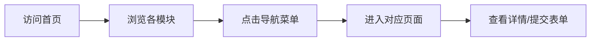
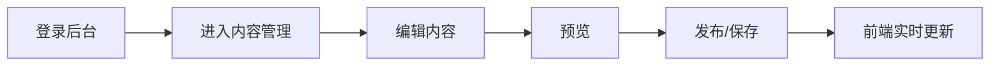
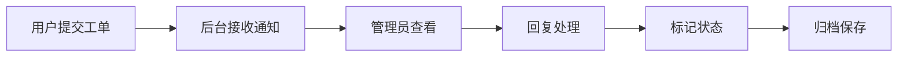

# 游戏官网产品需求文档 (PRD)

## 1. 产品概述
游戏官方网站，面向玩家提供游戏资讯、活动、下载等服务，同时配备管理后台用于内容运营。
- 核心目的：打造专业、美观的游戏官方展示平台，服务玩家社群，支撑运营需求
- 目标用户：游戏玩家、潜在用户、运营管理人员

## 2. 核心功能

### 2.1 用户角色
| 角色 | 访问方式 | 核心权限 |
|------|----------|----------|
| 普通用户 | 公开访问 | 浏览首页、资讯、活动、下载、玩家服务、合规公示 |
| 管理员 | 后台登录 | 内容管理、工单处理、系统设置、合规管理 |

### 2.2 功能模块

#### 用户端模块
1. **首页**：首屏轮播Banner、游戏核心亮点、最新资讯、热门活动、游戏素材预览、社群二维码
2. **游戏介绍页**：世界观、核心角色、基础玩法、游戏特色
3. **资讯中心**：资讯分类、列表、详情、搜索、分页（公告/版本/活动）
4. **活动中心**：活动卡片展示、状态标注、跳转功能、上下架配置
5. **下载中心**：全渠道下载入口、配置说明、安装FAQ、手机号预约
6. **玩家服务页**：FAQ问答、问题反馈工单、客服通道、账号帮助
7. **合规公示页**：用户协议、隐私政策、未成年人保护、版权声明

#### 管理后台模块
1. **基础内容管理**：资讯增删改查/置顶、活动配置/上下架、首页模块素材配置、导航菜单配置
2. **工单与用户管理**：预约用户数据查看、反馈工单接收/回复/归档
3. **基础系统设置**：网站名称、LOGO、备案、版权、账号权限
4. **合规管理**：合规文档在线编辑、实时同步

### 2.3 页面详情
| 页面名称 | 模块名称 | 功能描述 |
|---------|---------|---------|
| 首页 | 轮播Banner | 自动轮播、手动切换、后台可配置 |
| 首页 | 核心亮点 | 图标+文案展示，后台可编辑 |
| 首页 | 最新资讯 | 展示最新3条资讯，跳转详情 |
| 首页 | 热门活动 | 展示进行中活动卡片 |
| 首页 | 素材预览 | 游戏截图/视频预览区 |
| 首页 | 社群二维码 | 微信/QQ社群二维码展示 |
| 游戏介绍 | 世界观 | 图文展示游戏背景故事 |
| 游戏介绍 | 核心角色 | 角色卡片展示 |
| 游戏介绍 | 基础玩法 | 玩法流程图文说明 |
| 游戏介绍 | 游戏特色 | 特色卖点展示 |
| 资讯中心 | 资讯列表 | 分类筛选、搜索、分页 |
| 资讯中心 | 资讯详情 | 富文本内容展示 |
| 活动中心 | 活动卡片 | 状态标签（进行中/即将开始/已结束） |
| 下载中心 | 下载入口 | 多渠道下载按钮 |
| 下载中心 | 预约功能 | 手机号预约表单 |
| 玩家服务 | FAQ | 折叠式问答列表 |
| 玩家服务 | 工单提交 | 用户问题反馈表单 |
| 合规公示 | 文档展示 | 各合规文档分页展示 |
| 管理后台 | 资讯管理 | 富文本编辑器、置顶功能 |
| 管理后台 | 活动管理 | 上下架开关、时间配置 |
| 管理后台 | 工单管理 | 回复、状态标记、归档 |
| 管理后台 | 系统设置 | 基础配置项表单 |

## 3. 核心流程

### 用户浏览流程

### 管理员内容发布流程

### 用户反馈工单流程

## 4. 用户界面设计

### 4.1 设计风格
- **主色调**：深蓝色系 (#1a2a4a) 配合霓虹青色 (#00f5ff) 点缀，科技感游戏风格
- **辅助色**：渐变紫 (#6c3ce6)、金色 (#ffd700) 用于重要按钮和状态标识
- **背景**：深色主题配合网格纹理和光效，营造游戏氛围
- **按钮样式**：圆角矩形，带发光hover效果，渐变填充
- **字体**：标题使用 Orbitron（科技感），正文使用 Noto Sans SC（清晰易读）
- **布局风格**：卡片式布局，大留白，不对称网格，悬浮动效
- **图标风格**：线性图标，配合发光效果，游戏UI风格

### 4.2 页面设计概述
| 页面名称 | 模块名称 | UI元素 |
|---------|---------|--------|
| 首页 | 轮播Banner | 全屏宽度、渐变遮罩、滑动动画、指示器 |
| 首页 | 核心亮点 | 图标卡片、hover上浮、渐入动画 |
| 首页 | 资讯卡片 | 缩略图+标题+日期、悬浮缩放 |
| 游戏介绍 | 角色展示 | 大图+信息卡片、横向滚动 |
| 资讯中心 | 列表页 | 双栏布局、分类标签、分页组件 |
| 活动中心 | 活动卡片 | 角标状态、倒计时、渐变边框 |
| 下载中心 | 下载按钮 | 大尺寸、平台图标、发光效果 |
| 管理后台 | 侧边栏 | 折叠菜单、图标导航、深色主题 |

### 4.3 响应式
- 桌面优先设计，适配 1920px、1440px、1024px
- 平板端自适应调整卡片数量和布局
- 移动端单列布局，汉堡菜单，触摸优化

## 5. 非功能性需求
- 所有模块支持后台开关控制
- 内容实时更新，无需重启服务
- TS 强类型校验，Eslint 代码规范
- 使用不常用端口（如 8765）
- 支持 concurrent 并发启动前后端
