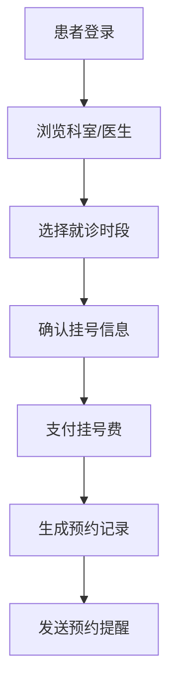
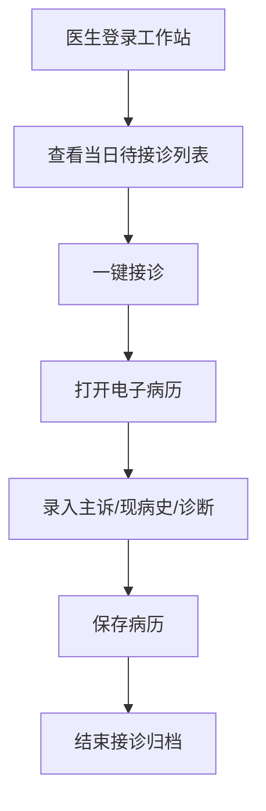
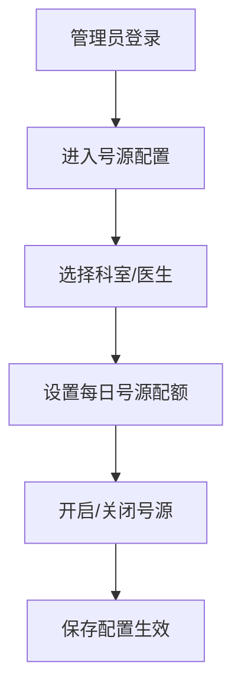

# 医院前后台一体化管理系统 PRD

## 1. 产品概述

医院前后台一体化管理系统是一款面向中小型医疗机构的综合性信息化管理平台，覆盖患者端、医护端、管理端三大场景，实现线上挂号、门诊接诊、后台管理的全流程数字化。系统通过统一权限引擎管理七大角色，整合医院资源配置、数据字典、消息通知等基础能力，提升医院运营效率与患者就医体验。

## 2. 核心功能

### 2.1 用户角色

| 角色 | 注册方式 | 核心权限 |
|------|----------|----------|
| 超级管理员 | 系统预置 | 全系统权限配置、角色管理、数据字典维护 |
| 院办 | 后台创建 | 全院数据统计、人员管理、科室配置 |
| 门诊医生 | 后台创建 | 接诊看板、电子病历书写、接诊归档 |
| 护士 | 后台创建 | 患者状态管理、分诊协助 |
| 财务 | 后台创建 | 收费项目管理、费用统计 |
| 药剂 | 后台创建 | 药品字典维护、发药确认 |
| 医技 | 后台创建 | 检查项目管理、结果录入 |
| 患者 | 手机号自助注册 | 挂号预约、就诊记录查看、个人信息管理 |

### 2.2 功能模块

1. **权限引擎模块**：角色管理、权限分配、菜单控制、数据权限隔离
2. **系统配置模块**：医院信息、科室分类、就诊时段、收费项目配置
3. **数据字典模块**：地区、疾病、药品、检查项目等标准数据维护
4. **文件上传模块**：统一文件存储、图片/文档上传管理
5. **消息通知模块**：站内消息、预约提醒、系统公告
6. **患者端模块**：注册登录、实名认证、科室医生浏览、挂号预约、记录查询
7. **医护工作站**：当日接诊看板、待接诊列表、电子病历、接诊归档
8. **管理后台**：账号管理、科室管理、医护档案、号源配置、统计报表

### 2.3 页面详情

| 页面名称 | 模块名称 | 功能描述 |
|-----------|-------------|---------------------|
| 登录页 | 认证模块 | 手机号/账号密码登录、角色选择 |
| 患者注册页 | 认证模块 | 手机号注册、实名认证 |
| 首页（患者端） | 患者端 | 科室列表、推荐医生、快捷挂号入口 |
| 科室列表页 | 患者端 | 科室分类展示、科室详情 |
| 医生列表页 | 患者端 | 按科室筛选医生、医生简介 |
| 挂号预约页 | 患者端 | 选择时段、确认挂号 |
| 我的预约页 | 患者端 | 预约记录、取消预约 |
| 个人中心页 | 患者端 | 资料修改、密码修改、就诊档案 |
| 接诊看板页 | 医护端 | 今日接诊统计、待接诊列表、状态流转 |
| 电子病历页 | 医护端 | 主诉现病史录入、诊断保存、病历查看 |
| 账号管理页 | 管理端 | 人员增删改查、禁用启用、密码重置 |
| 科室管理页 | 管理端 | 科室新增编辑、启停管理 |
| 医护档案页 | 管理端 | 职称、科室、执业信息录入 |
| 号源配置页 | 管理端 | 每日号源配额、号源开关 |
| 统计报表页 | 管理端 | 接诊量、挂号数据统计 |
| 数据字典页 | 管理端 | 地区、疾病、药品等标准数据维护 |
| 系统配置页 | 管理端 | 医院信息、时段、收费项目配置 |

## 3. 核心流程

### 3.1 患者挂号流程

### 3.2 医生接诊流程

### 3.3 管理员号源配置流程

## 4. 用户界面设计

### 4.1 设计风格

- **主色调**：医疗蓝 `#1677ff`，传递专业、可信的医疗品牌形象
- **辅助色**：健康绿 `#52c41a`（成功/正常状态）、警示橙 `#faad14`（提醒状态）、危险红 `#ff4d4f`（错误/警告）
- **中性色**：以 `#f0f2f5` 为背景，`#333333` 为主文字，层次分明
- **按钮风格**：圆角 6px，轻微阴影，hover 时有背景色加深动效
- **字体**：系统字体栈，正文 14px，标题 16-20px，层级清晰
- **布局风格**：卡片式布局 + 顶部导航 + 侧边菜单，信息密度适中
- **图标风格**：使用 Lucide 线性图标，保持简洁统一

### 4.2 页面设计概述

| 页面名称 | 模块名称 | UI 元素 |
|-----------|-------------|-------------|
| 登录页 | 认证模块 | 居中卡片表单、角色切换 Tab、品牌 Logo、渐变背景 |
| 首页（患者端） | 患者端 | 顶部导航、轮播 Banner、科室图标网格、推荐医生卡片 |
| 挂号预约页 | 患者端 | 医生信息卡、日期选择器、时段按钮组、确认弹窗 |
| 接诊看板页 | 医护端 | 顶部统计卡片、待接诊列表（带状态标签）、快捷操作按钮 |
| 电子病历页 | 医护端 | 患者信息侧栏、表单分区（主诉/现病史/诊断）、保存按钮组 |
| 管理后台页面 | 管理端 | 侧边菜单、面包屑、数据表格、操作列、筛选搜索栏 |

### 4.3 响应式设计

- 采用桌面优先设计，以 1440px 为基准宽度
- 管理端页面最小支持 1280px 宽度
- 患者端页面适配平板（768px）和移动端（375px）
- 移动端患者端采用底部 Tab 导航替代顶部菜单

### 4.4 交互动效

- 页面切换采用淡入淡出过渡（300ms）
- 按钮 hover 有背景色过渡和轻微上浮效果
- 表单校验错误采用抖动动画提示
- 数据加载采用骨架屏占位
- 侧边菜单展开/收起有平滑过渡动画
