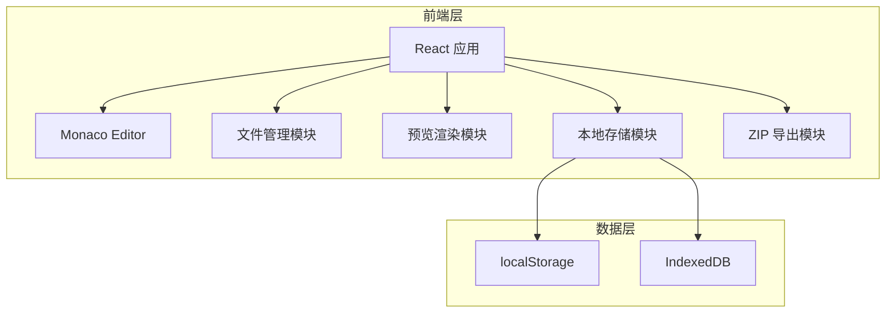

## 1. 架构设计



## 2. 技术说明

- **前端框架**：React@18 + TypeScript + Vite
- **代码编辑器**：@monaco-editor/react
- **样式方案**：Tailwind CSS@3
- **ZIP 导出**：jszip
- **本地存储**：localStorage + IndexedDB
- **图标库**：lucide-react

## 3. 目录结构

```
src/
├── components/
│   ├── MenuBar/          # 顶部菜单栏
│   ├── FileTree/         # 文件树
│   ├── Editor/           # Monaco 编辑器
│   └── Preview/          # 预览区
├── hooks/
│   ├── useFiles.ts       # 文件管理 Hook
│   ├── useLocalStorage.ts # 本地存储 Hook
│   └── usePreview.ts     # 预览 Hook
├── utils/
│   ├── zip.ts            # ZIP 导出工具
│   └── template.ts       # 文件模板
├── types/
│   └── index.ts          # 类型定义
├── App.tsx
└── main.tsx
```

## 4. 核心数据结构

```typescript
interface FileItem {
  id: string;
  name: string;
  type: 'file' | 'folder';
  content: string;
  language: 'html' | 'css' | 'javascript';
  parentId: string | null;
}

interface ProjectState {
  files: FileItem[];
  activeFileId: string | null;
  isDirty: boolean;
  lastSaved: Date | null;
}
```

## 5. 核心功能实现方案

### 5.1 Monaco Editor 集成
- 使用 `@monaco-editor/react` 组件
- 配置 HTML/CSS/JavaScript 语言支持
- 启用语法高亮、代码提示、格式化
- 设置 VSCode 暗色主题

### 5.2 文件管理
- 内存中维护文件树结构
- 支持新建、重命名、删除文件
- 文件切换时保存当前编辑器状态
- 默认创建 index.html、style.css、app.js

### 5.3 实时预览
- 使用 iframe 沙箱环境
- 监听文件变化，自动重新渲染
- HTML 中注入 CSS 和 JavaScript
- 实现无刷新热更新

### 5.4 本地存储
- 自动保存到 localStorage
- 页面加载时恢复项目状态
- 使用 debounce 优化保存频率

### 5.5 ZIP 导出
- 使用 jszip 库打包文件
- 保持目录结构
- 触发浏览器下载
