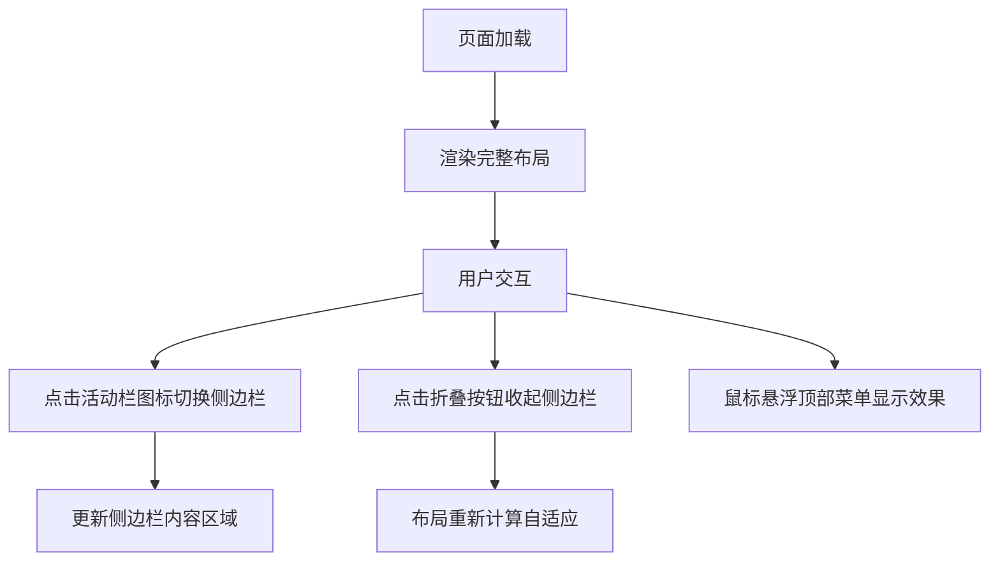

## 1. 产品概述

Web 端在线 VSCode 编辑器是一个基于浏览器的代码编辑器，提供与本地 VSCode 相似的开发体验。第一期版本聚焦于基础架构搭建和静态 UI 布局实现，为后续功能迭代奠定基础。

- 目标用户：需要在线编码环境的开发者、教育工作者、团队协作者
- 产品价值：提供跨平台、无需安装的轻量化代码编辑体验

## 2. 核心功能

### 2.1 功能模块

1. **主编辑器界面**：经典 VSCode 四分布局
2. **布局容器组件**：可复用的布局框架
3. **交互组件**：侧边栏折叠、活动栏切换、菜单悬浮效果

### 2.2 页面详情

| 页面名称 | 模块名称 | 功能描述 |
|-----------|-------------|---------------------|
| 编辑器主页 | 顶部菜单栏 | 文件、编辑、查看等菜单 hover 悬浮效果 |
| 编辑器主页 | 左侧活动栏 | 资源管理器、搜索、Git 等图标切换 |
| 编辑器主页 | 资源管理器侧边栏 | 可折叠/展开的侧边栏区域 |
| 编辑器主页 | 中间编辑区 | 空白面板，预留后续编辑器插槽 |
| 编辑器主页 | 底部状态栏 | 分支信息、编码格式、行号等文字展示 |

## 3. 核心流程

## 4. 用户界面设计

### 4.1 设计风格

- **主色调**：采用 VSCode 经典深色主题，#1e1e1e 为主背景色
- **强调色**：#007acc（VSCode 蓝）作为选中和高亮色
- **字体**：使用等宽字体 Consolas / 'Courier New' / monospace
- **布局风格**：严格的四分布局，Flex + Grid 混合布局
- **图标风格**：简洁的线性图标，与 VSCode 保持一致

### 4.2 页面设计概述

| 页面名称 | 模块名称 | UI 元素 |
|-----------|-------------|-------------|
| 编辑器主页 | 顶部菜单栏 | 深色背景、白色文字、hover 背景高亮 |
| 编辑器主页 | 左侧活动栏 | 48px 宽度、图标垂直排列、选中高亮 |
| 编辑器主页 | 侧边栏 | 250px 宽度、可折叠、带标题栏 |
| 编辑器主页 | 编辑区 | 大面积空白、浅色背景对比 |
| 编辑器主页 | 状态栏 | 22px 高度、蓝色强调色区域、信息文字 |

### 4.3 响应式设计

- **桌面端优先**：针对 1024px 以上宽度优化
- **窗口缩放自适应**：使用 Flex + Grid 实现动态布局调整
- **最小宽度限制**：设置 800px 最小宽度保证基本可用性
- **侧边栏折叠**：折叠时编辑区自动扩展填充空间

### 4.4 交互细节

- **侧边栏折叠动画**：200ms 平滑过渡
- **菜单 hover 效果**：背景色渐变、圆角处理
- **图标切换**：选中状态颜色变化、指示器
- **窗口 resize**：防抖处理布局重计算