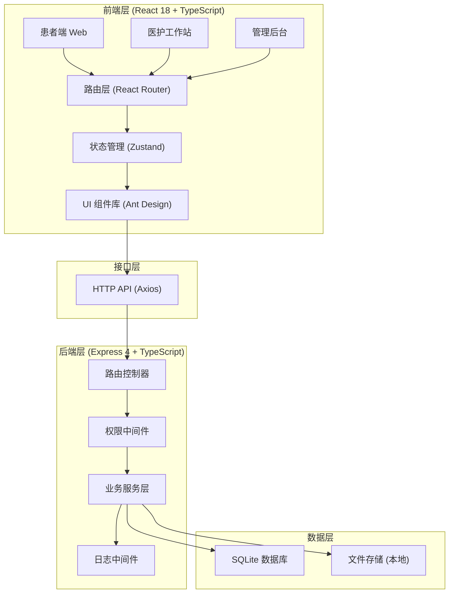
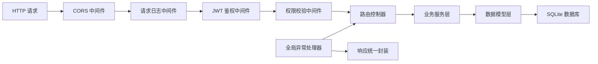
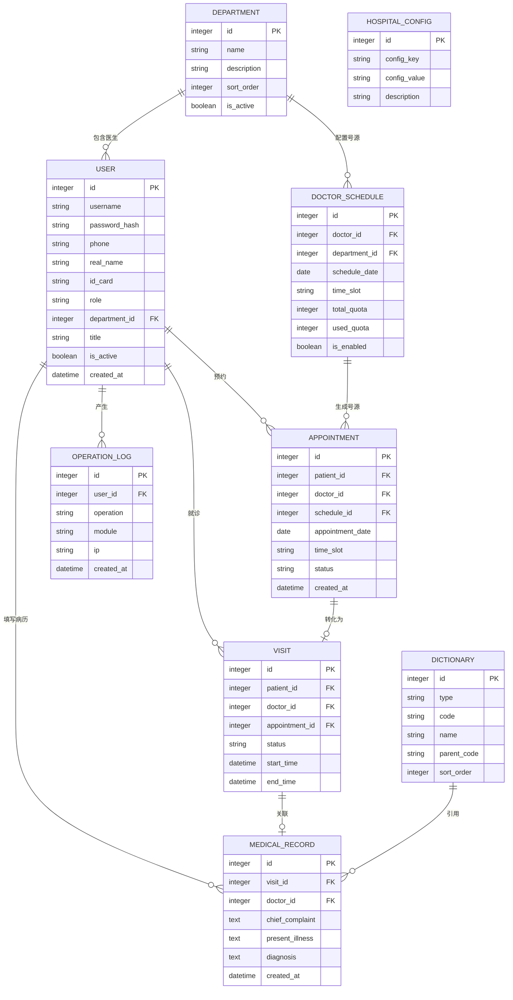

# 医院前后台一体化管理系统 技术架构文档

## 1. 架构设计



## 2. 技术选型说明

| 层级 | 技术选型 | 版本 | 说明 |
|------|----------|------|------|
| 前端框架 | React | 18.x | 组件化开发，生态成熟 |
| 前端语言 | TypeScript | 5.x | 类型安全，提升可维护性 |
| 构建工具 | Vite | 5.x | 开发体验好，构建速度快 |
| 路由 | react-router-dom | 6.x | 声明式路由，支持嵌套路由 |
| 状态管理 | zustand | 4.x | 轻量级，API 简洁 |
| UI 组件库 | antd | 5.x | 企业级组件库，适合管理后台 |
| HTTP 客户端 | axios | 1.x | 拦截器支持，请求取消 |
| 后端框架 | Express | 4.x | 轻量级，中间件生态丰富 |
| 后端语言 | TypeScript | 5.x | 前后端类型复用 |
| 数据库 | SQLite | 3.x | 零配置，适合中小规模项目 |
| ORM | better-sqlite3 | 9.x | 同步 API，性能优异 |
| 鉴权 | JWT | jsonwebtoken | 无状态认证 |
| 密码加密 | bcryptjs | 2.x | 安全哈希 |
| 文件上传 | multer | 1.x | 多部分表单处理 |
| 代码规范 | ESLint | 8.x | 代码质量检查 |
| 代码风格 | Prettier | 3.x | 代码格式化 |

## 3. 项目结构

```
.
├── .trae/documents/          # 项目文档
├── client/                   # 前端代码
│   ├── src/
│   │   ├── components/       # 公共组件
│   │   ├── pages/            # 页面组件
│   │   │   ├── patient/      # 患者端页面
│   │   │   ├── medical/      # 医护端页面
│   │   │   └── admin/        # 管理端页面
│   │   ├── hooks/            # 自定义 Hooks
│   │   ├── store/            # Zustand 状态管理
│   │   ├── router/           # 路由配置
│   │   ├── services/         # API 服务
│   │   ├── utils/            # 工具函数
│   │   ├── types/            # TypeScript 类型定义
│   │   ├── layouts/          # 布局组件
│   │   └── main.tsx          # 入口文件
│   ├── index.html
│   ├── vite.config.ts
│   └── package.json
├── server/                   # 后端代码
│   ├── src/
│   │   ├── controllers/      # 控制器层
│   │   ├── services/         # 业务逻辑层
│   │   ├── models/           # 数据模型层
│   │   ├── middleware/       # 中间件
│   │   ├── routes/           # 路由定义
│   │   ├── utils/            # 工具函数
│   │   ├── types/            # 类型定义
│   │   ├── config/           # 配置文件
│   │   ├── database/         # 数据库初始化与迁移
│   │   └── index.ts          # 入口文件
│   └── package.json
├── shared/                   # 前后端共享类型
│   └── types.ts
├── uploads/                  # 文件上传目录
├── .gitignore
├── .eslintrc.js
├── .prettierrc
├── tsconfig.json
└── package.json              # 根 package.json (concurrently)
```

## 4. 路由定义

### 4.1 前端路由

| 路由 | 页面 | 权限角色 |
|------|------|----------|
| `/login` | 登录页 | 公开 |
| `/register` | 患者注册页 | 公开 |
| `/patient` | 患者端首页 | 患者 |
| `/patient/departments` | 科室列表 | 患者 |
| `/patient/doctors/:deptId` | 医生列表 | 患者 |
| `/patient/appointment/:doctorId` | 挂号预约 | 患者 |
| `/patient/my-appointments` | 我的预约 | 患者 |
| `/patient/profile` | 个人中心 | 患者 |
| `/medical` | 医护工作站首页 | 医生/护士 |
| `/medical/reception` | 接诊看板 | 医生 |
| `/medical/medical-record/:visitId` | 电子病历 | 医生 |
| `/admin` | 管理后台首页 | 管理员/院办 |
| `/admin/accounts` | 账号管理 | 超级管理员/院办 |
| `/admin/departments` | 科室管理 | 超级管理员/院办 |
| `/admin/staff` | 医护档案 | 超级管理员/院办 |
| `/admin/schedule` | 号源配置 | 超级管理员/院办 |
| `/admin/statistics` | 统计报表 | 超级管理员/院办 |
| `/admin/dictionary` | 数据字典 | 超级管理员 |
| `/admin/config` | 系统配置 | 超级管理员 |

### 4.2 后端 API 路由

| 方法 | 路径 | 模块 | 说明 |
|------|------|------|------|
| POST | `/api/auth/login` | 认证 | 登录 |
| POST | `/api/auth/register` | 认证 | 患者注册 |
| GET | `/api/auth/profile` | 认证 | 获取当前用户信息 |
| PUT | `/api/auth/password` | 认证 | 修改密码 |
| GET | `/api/departments` | 科室 | 获取科室列表 |
| POST | `/api/departments` | 科室 | 新增科室 |
| PUT | `/api/departments/:id` | 科室 | 编辑科室 |
| DELETE | `/api/departments/:id` | 科室 | 删除科室 |
| GET | `/api/doctors` | 医生 | 获取医生列表 |
| GET | `/api/doctors/:id` | 医生 | 获取医生详情 |
| GET | `/api/appointments` | 预约 | 获取预约列表 |
| POST | `/api/appointments` | 预约 | 创建预约 |
| PUT | `/api/appointments/:id/cancel` | 预约 | 取消预约 |
| GET | `/api/visits/today` | 接诊 | 获取今日接诊列表 |
| PUT | `/api/visits/:id/receive` | 接诊 | 接诊 |
| PUT | `/api/visits/:id/finish` | 接诊 | 结束接诊 |
| GET | `/api/medical-records/:visitId` | 病历 | 获取病历 |
| POST | `/api/medical-records` | 病历 | 保存病历 |
| GET | `/api/admin/accounts` | 账号 | 获取账号列表 |
| POST | `/api/admin/accounts` | 账号 | 创建账号 |
| PUT | `/api/admin/accounts/:id` | 账号 | 编辑账号 |
| PUT | `/api/admin/accounts/:id/reset-password` | 账号 | 重置密码 |
| GET | `/api/admin/schedule/config` | 号源 | 获取号源配置 |
| POST | `/api/admin/schedule/config` | 号源 | 保存号源配置 |
| GET | `/api/admin/statistics/overview` | 统计 | 获取概览统计 |
| GET | `/api/dictionary/:type` | 字典 | 获取数据字典 |
| POST | `/api/upload` | 文件 | 文件上传 |

## 5. 服务端架构



### 5.1 分层说明

- **中间件层**：处理跨域、日志、鉴权、权限校验等横切关注点
- **控制器层**：接收请求，参数校验，调用业务服务，返回响应
- **服务层**：核心业务逻辑实现，事务控制
- **模型层**：数据库操作封装，SQL 语句维护

## 6. 数据模型

### 6.1 ER 图



### 6.2 数据库初始化脚本

数据库初始化将在服务启动时自动执行，包含：
- 建表语句
- 索引创建
- 初始数据插入（超级管理员账号、默认科室、标准数据字典）
- 超级管理员默认账号：`admin` / `admin123`

## 7. 开发与构建

### 7.1 脚本命令

| 命令 | 说明 |
|------|------|
| `npm run dev` | 同时启动前端 (端口 5174) 和后端 (端口 3001) |
| `npm run dev:client` | 仅启动前端 |
| `npm run dev:server` | 仅启动后端 |
| `npm run build` | 构建前端和后端 |
| `npm run lint` | 运行 ESLint 检查 |
| `npm run typecheck` | 运行 TypeScript 类型检查 |

### 7.2 端口配置

- 前端开发服务器：`5174`（不常用端口）
- 后端 API 服务器：`3001`（不常用端口）
- 可在 `.env` 文件中修改

### 7.3 代码质量

- 开启 TypeScript `strict: true` 强类型校验
- ESLint 采用 `@typescript-eslint/recommended` 规则集
- Prettier 统一代码风格
- 提交前自动运行 lint 和 typecheck
