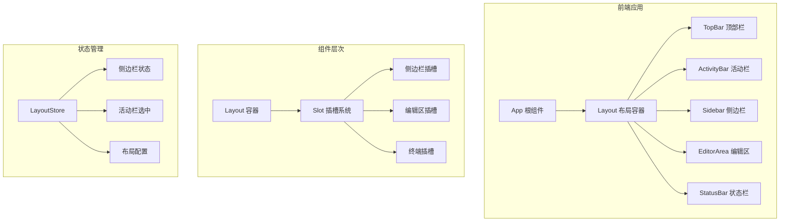

## 1. 架构设计



## 2. 技术栈说明

- **前端框架**：React@18 + TypeScript
- **构建工具**：Vite@5
- **样式方案**：TailwindCSS@3
- **状态管理**：React Context / useState（轻量级）
- **图标库**：lucide-react
- **代码规范**：ESLint + Prettier

## 3. 目录结构设计

```
src/
├── components/
│   ├── layout/
│   │   ├── Layout.tsx          # 主布局容器
│   │   ├── TopBar.tsx          # 顶部菜单栏
│   │   ├── ActivityBar.tsx     # 左侧活动栏
│   │   ├── Sidebar.tsx         # 侧边栏面板
│   │   ├── EditorArea.tsx      # 编辑区域
│   │   └── StatusBar.tsx       # 底部状态栏
│   └── common/
│       └── Icon.tsx            # 图标组件
├── hooks/
│   └── useLayout.ts            # 布局状态钩子
├── types/
│   └── layout.ts               # 布局类型定义
├── styles/
│   └── globals.css             # 全局样式
├── App.tsx                     # 根组件
└── main.tsx                    # 入口文件
```

## 4. 组件接口定义

### 4.1 Layout 容器组件

```typescript
interface LayoutProps {
  sidebar?: React.ReactNode;
  editor?: React.ReactNode;
  terminal?: React.ReactNode;
}

interface LayoutState {
  sidebarCollapsed: boolean;
  activePanel: string;
  sidebarWidth: number;
}
```

### 4.2 ActivityBar 组件

```typescript
interface ActivityItem {
  id: string;
  icon: React.ReactNode;
  tooltip: string;
}

interface ActivityBarProps {
  items: ActivityItem[];
  activeId: string;
  onSelect: (id: string) => void;
}
```

### 4.3 Sidebar 组件

```typescript
interface SidebarProps {
  title: string;
  collapsed: boolean;
  width: number;
  onToggle: () => void;
  children: React.ReactNode;
}
```

## 5. 核心技术点

### 5.1 布局实现方案

- **整体布局**：Flex 垂直布局（顶部栏 + 主体 + 状态栏）
- **主体区域**：Grid 三列布局（活动栏 + 侧边栏 + 编辑区）
- **自适应策略**：CSS Grid `minmax()` + `fr` 单位
- **折叠动画**：CSS transition + transform

### 5.2 状态管理

```typescript
// useLayout hook
const useLayout = () => {
  const [sidebarCollapsed, setSidebarCollapsed] = useState(false);
  const [activePanel, setActivePanel] = useState('explorer');
  
  const toggleSidebar = () => setSidebarCollapsed(!sidebarCollapsed);
  const selectPanel = (id: string) => setActivePanel(id);
  
  return { sidebarCollapsed, activePanel, toggleSidebar, selectPanel };
};
```

### 5.3 响应式断点

```css
/* Desktop */
@media (min-width: 1024px) {
  .sidebar { width: 250px; }
}

/* Tablet */
@media (max-width: 1023px) {
  .sidebar { width: 220px; }
}

/* Minimum width */
.app-container { min-width: 800px; }
```

## 6. 插槽设计

Layout 组件预留以下插槽入口：

| 插槽名称 | 位置 | 用途 |
|---------|------|------|
| sidebarContent | 侧边栏面板内 | 文件树、搜索结果、Git 面板 |
| editorContent | 编辑区域 | 代码编辑器、标签页、欢迎页 |
| terminalContent | 编辑区下方 | 终端面板、输出控制台 |
| topBarExtra | 顶部栏右侧 | 用户菜单、通知、设置 |