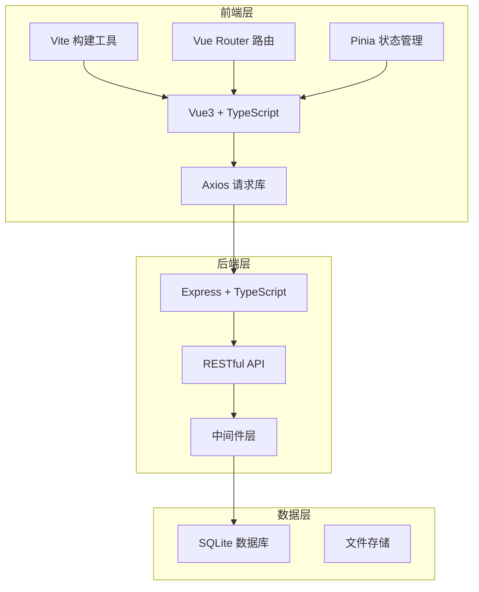
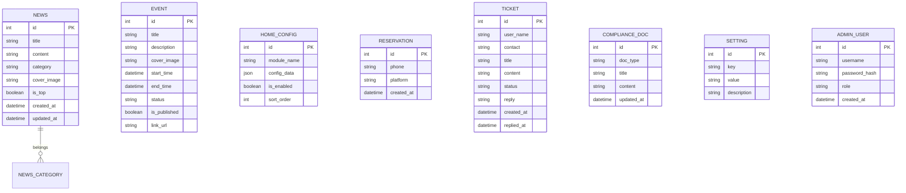
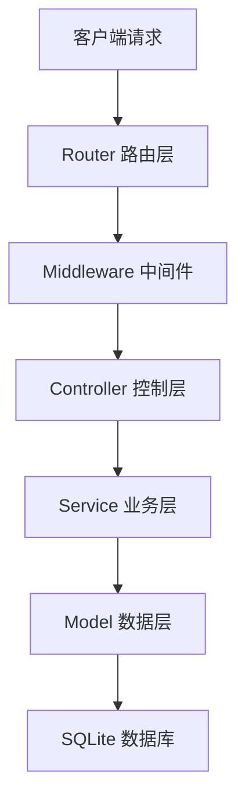

# 游戏官网技术架构文档

## 1. 架构设计



## 2. 技术说明

### 2.1 前端技术栈
- **框架**: Vue 3.4+ (Composition API)
- **语言**: TypeScript 5.0+ (严格模式)
- **构建工具**: Vite 5.0+
- **路由**: Vue Router 4.x
- **状态管理**: Pinia 2.x
- **HTTP 客户端**: Axios
- **UI 组件库**: Element Plus
- **样式方案**: SCSS + CSS Variables
- **代码规范**: ESLint + Prettier

### 2.2 后端技术栈
- **框架**: Express 4.18+
- **语言**: TypeScript 5.0+
- **数据库**: SQLite 3 (better-sqlite3)
- **ORM**: 原生 SQL + 类型安全封装
- **文件上传**: multer
- **跨域**: cors
- **日志**: winston

### 2.3 开发配置
- **前端端口**: 8765 (不常用端口)
- **后端端口**: 8766
- **并发启动**: concurrently
- **热重载**: 前后端各自支持
- **代码校验**: TS 严格模式 + ESLint

## 3. 项目目录结构

```
dogfooding3/
├── frontend/                 # 前端项目
│   ├── src/
│   │   ├── api/             # API 接口
│   │   ├── components/      # 公共组件
│   │   ├── views/           # 页面组件
│   │   │   ├── client/      # 用户端页面
│   │   │   └── admin/       # 管理后台页面
│   │   ├── router/          # 路由配置
│   │   ├── store/           # Pinia 状态
│   │   ├── types/           # TypeScript 类型
│   │   ├── utils/           # 工具函数
│   │   ├── assets/          # 静态资源
│   │   ├── styles/          # 全局样式
│   │   ├── App.vue
│   │   └── main.ts
│   ├── public/
│   ├── index.html
│   ├── vite.config.ts
│   ├── tsconfig.json
│   └── package.json
├── backend/                  # 后端项目
│   ├── src/
│   │   ├── controllers/     # 控制器
│   │   ├── services/        # 业务逻辑
│   │   ├── models/          # 数据模型
│   │   ├── routes/          # 路由定义
│   │   ├── middleware/      # 中间件
│   │   ├── utils/           # 工具函数
│   │   ├── types/           # 类型定义
│   │   ├── database/        # 数据库相关
│   │   │   ├── init.ts      # 初始化脚本
│   │   │   └── schema.sql   # 表结构
│   │   ├── config/          # 配置文件
│   │   └── app.ts
│   ├── uploads/             # 上传文件目录
│   ├── database/            # SQLite 数据库文件
│   ├── tsconfig.json
│   └── package.json
├── .gitignore
├── package.json             # 根目录 package.json (并发启动)
└── README.md
```

## 4. 路由定义

### 4.1 前端路由 (用户端)
| 路由路径 | 页面名称 | 说明 |
|---------|---------|------|
| / | 首页 | 轮播Banner、核心亮点、资讯活动等 |
| /intro | 游戏介绍 | 世界观、角色、玩法、特色 |
| /news | 资讯中心 | 资讯列表、分类筛选 |
| /news/:id | 资讯详情 | 单篇资讯内容展示 |
| /events | 活动中心 | 活动卡片列表 |
| /download | 下载中心 | 下载入口、预约功能 |
| /service | 玩家服务 | FAQ、工单提交 |
| /compliance/:type | 合规公示 | 各类合规文档 |

### 4.2 前端路由 (管理后台)
| 路由路径 | 页面名称 | 说明 |
|---------|---------|------|
| /admin | 后台首页 | 数据概览 |
| /admin/login | 后台登录 | 管理员登录 |
| /admin/news | 资讯管理 | 资讯增删改查 |
| /admin/events | 活动管理 | 活动配置上下架 |
| /admin/home | 首页配置 | 首页模块管理 |
| /admin/tickets | 工单管理 | 用户反馈处理 |
| /admin/reservations | 预约管理 | 预约用户数据 |
| /admin/settings | 系统设置 | 基础配置 |
| /admin/compliance | 合规管理 | 文档编辑 |

### 4.3 后端 API 路由
| 路由前缀 | 模块 | 说明 |
|---------|------|------|
| /api/news | 资讯 | CRUD、置顶、分类 |
| /api/events | 活动 | CRUD、上下架 |
| /api/home | 首页配置 | Banner、亮点等 |
| /api/download | 下载 | 下载渠道、预约 |
| /api/tickets | 工单 | 提交、回复、状态 |
| /api/compliance | 合规 | 文档获取、编辑 |
| /api/settings | 系统设置 | 基础配置 |
| /api/admin | 管理员 | 登录、权限 |
| /api/upload | 文件上传 | 图片、文件上传 |

## 5. API 响应格式

```typescript
// 统一响应格式
interface ApiResponse<T = any> {
  code: number;      // 0: 成功, 其他: 错误码
  message: string;   // 提示信息
  data: T;           // 数据
}

// 分页参数
interface PaginationParams {
  page: number;
  pageSize: number;
}

// 分页响应
interface PaginatedResponse<T> {
  list: T[];
  total: number;
  page: number;
  pageSize: number;
}
```

## 6. 数据模型

### 6.1 ER 图



### 6.2 表结构 SQL

```sql
-- 资讯表
CREATE TABLE IF NOT EXISTS news (
  id INTEGER PRIMARY KEY AUTOINCREMENT,
  title TEXT NOT NULL,
  content TEXT NOT NULL,
  category TEXT NOT NULL DEFAULT 'announcement',
  cover_image TEXT,
  is_top INTEGER DEFAULT 0,
  view_count INTEGER DEFAULT 0,
  created_at DATETIME DEFAULT CURRENT_TIMESTAMP,
  updated_at DATETIME DEFAULT CURRENT_TIMESTAMP
);

-- 活动表
CREATE TABLE IF NOT EXISTS events (
  id INTEGER PRIMARY KEY AUTOINCREMENT,
  title TEXT NOT NULL,
  description TEXT,
  cover_image TEXT,
  start_time DATETIME,
  end_time DATETIME,
  status TEXT DEFAULT 'upcoming',
  is_published INTEGER DEFAULT 0,
  link_url TEXT,
  sort_order INTEGER DEFAULT 0,
  created_at DATETIME DEFAULT CURRENT_TIMESTAMP,
  updated_at DATETIME DEFAULT CURRENT_TIMESTAMP
);

-- 首页配置表
CREATE TABLE IF NOT EXISTS home_config (
  id INTEGER PRIMARY KEY AUTOINCREMENT,
  module_name TEXT NOT NULL UNIQUE,
  config_data TEXT NOT NULL,
  is_enabled INTEGER DEFAULT 1,
  sort_order INTEGER DEFAULT 0
);

-- 预约表
CREATE TABLE IF NOT EXISTS reservations (
  id INTEGER PRIMARY KEY AUTOINCREMENT,
  phone TEXT NOT NULL,
  platform TEXT,
  created_at DATETIME DEFAULT CURRENT_TIMESTAMP
);

-- 工单表
CREATE TABLE IF NOT EXISTS tickets (
  id INTEGER PRIMARY KEY AUTOINCREMENT,
  user_name TEXT,
  contact TEXT NOT NULL,
  title TEXT NOT NULL,
  content TEXT NOT NULL,
  status TEXT DEFAULT 'pending',
  reply TEXT,
  replied_at DATETIME,
  created_at DATETIME DEFAULT CURRENT_TIMESTAMP
);

-- 合规文档表
CREATE TABLE IF NOT EXISTS compliance_docs (
  id INTEGER PRIMARY KEY AUTOINCREMENT,
  doc_type TEXT NOT NULL UNIQUE,
  title TEXT NOT NULL,
  content TEXT NOT NULL,
  updated_at DATETIME DEFAULT CURRENT_TIMESTAMP
);

-- 系统设置表
CREATE TABLE IF NOT EXISTS settings (
  id INTEGER PRIMARY KEY AUTOINCREMENT,
  key TEXT NOT NULL UNIQUE,
  value TEXT NOT NULL,
  description TEXT
);

-- 管理员表
CREATE TABLE IF NOT EXISTS admin_users (
  id INTEGER PRIMARY KEY AUTOINCREMENT,
  username TEXT NOT NULL UNIQUE,
  password_hash TEXT NOT NULL,
  role TEXT DEFAULT 'admin',
  created_at DATETIME DEFAULT CURRENT_TIMESTAMP
);

-- 创建索引
CREATE INDEX IF NOT EXISTS idx_news_category ON news(category);
CREATE INDEX IF NOT EXISTS idx_news_created_at ON news(created_at);
CREATE INDEX IF NOT EXISTS idx_events_status ON events(status);
CREATE INDEX IF NOT EXISTS idx_tickets_status ON tickets(status);
```

## 7. 后端架构分层



## 8. 开发规范

### 8.1 TypeScript 严格模式
- 启用 `strict: true`
- 禁止 `any` 类型（必要时使用 `unknown`）
- 显式定义函数返回类型
- 接口和类型定义首字母大写

### 8.2 ESLint 规则
- 基于 Vue 官方推荐规则
- 代码格式统一
- 禁止未使用变量
- 强制一致的导入顺序

### 8.3 Git 提交规范
- feat: 新功能
- fix: 修复bug
- docs: 文档更新
- style: 代码格式
- refactor: 重构
- chore: 构建/工具相关

## 9. 启动命令

```json
{
  "scripts": {
    "dev": "concurrently \"npm run dev:frontend\" \"npm run dev:backend\"",
    "dev:frontend": "cd frontend && npm run dev",
    "dev:backend": "cd backend && npm run dev",
    "build": "cd frontend && npm run build",
    "build:backend": "cd backend && npm run build",
    "lint": "cd frontend && npm run lint"
  }
}
```
